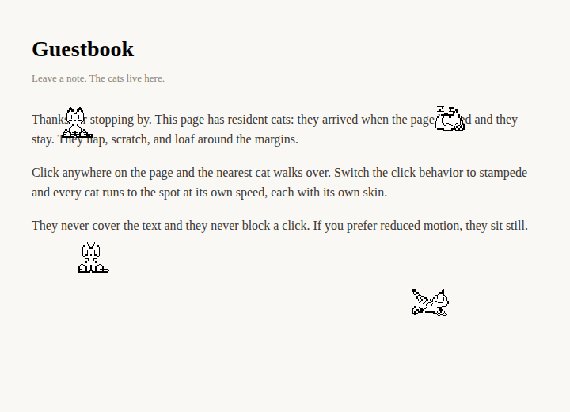

# Add Cats

Pixel cats that live on selected pages of a Digital Garden. Tag a page, and
resident cats appear, settle, and stay. Click or tap anywhere and the cats run
to that spot. Zero dependencies, no tracking, no third-party requests.



## Install

From the Digital Garden community browser after the plugin is listed, or paste
this repository URL into the plugin installer. For manual installation, copy the
repository into `src/plugins/add-cats/`, enable `add-cats` in
`src/plugins/plugins.json`, and rebuild.

The plugin ships the classic public-domain Neko sprites, so it works with no
configuration.

## Tag the pages that get cats

Cats appear on a page only when that page is tagged. Add the note flag to the
note's frontmatter:

```yaml
---
dg-add-cats: true
---
```

The plugin reads the flag through Digital Garden's note-settings mechanism, so
you decide per page: your guestbook can have cats, your resume stays serious.
Set `ADD_CATS_ENABLED=false` to turn the plugin off everywhere without touching
any note.

## Click behavior

- **clicked** (default) — the nearest cat walks to where you click.
- **stampede** — every cat runs to the click point, each at its own speed.

## Paw prints

A running cat leaves a fading trail of paw prints. The marks are the eight cells
of row 4 in a classic sheet — four variants facing south, plus the same four
rotated to face north — so the trail reuses the sheet's own pixel art instead of
shipping a separate asset.

The art has no east/west print, so a print encodes the vertical part of a
journey: a steep step picks the set that matches its direction, using the same
0.5 threshold as the walk sprites, and a mostly-horizontal run leans on its
horizontal direction instead (east reads as south, west as north). A print never
disagrees with the pose the cat is showing, but a purely sideways run is
approximated.

A sheet with no effects row (every 4-row oneko sheet, which is the usual shape of
a brought-your-own sheet) and a short classic sheet whose row 4 is not prints
borrow from the bundled classic sheet, so a brought-your-own cat gets a trail too.

A print is stamped every 26px of travel, so a fast cat and a slow cat leave the
same rhythm of marks, and at most 24 prints are alive at once — the oldest
retires first, so a long run cannot grow the DOM without bound. `trailFade` sets
how long a print takes to fade out, and `trail: false` turns the trail off.
Nothing is stamped when the visitor prefers reduced motion, which also stops the
cats from walking.

The stylesheet puts a translucent plate behind each mark so dark outline art
stays readable on a dark page. Remove the `background-color` on `.add-cats-print`
to draw bare prints.

## Skins

Five skins ship with the plugin, all derived from the public-domain classic
Neko sheet: `neko` (white), `ginger` (orange), `smokey` (grey), `midnight`
(slate) and `biscuit` (cream). By default each resident cat picks a random
bundled skin, so a page shows a mix. Set `skin` to pin one skin for every cat.

To pin a specific set of distinct cats, give `skin` a JSON array of skin ids —
one resident cat per id, cycling if there are more cats than ids:

```json
{ "skin": "[\"greta\",\"nigel\"]", "skins": "{\"greta\":\"/img/user/greta-neko.png\",\"nigel\":\"/img/user/nigel-neko.png\"}" }
```

This is how the plugin powers a "Meet the cats" page: Greta and Nigel render
side by side, each with their own sprite sheet.

### Bring your own sprite sheet

Any skin can be supplied by the site owner. Point a skin id at a sprite sheet
with the `skins` setting:

```json
{ "calico": "/nekos/calico.png", "grey-mittens": "https://example.com/cat.png" }
```

Then select it with `skin`, or list it and let the random picker use it. Sheets
must be the classic Neko layout (263x197, 8x6 grid of 32px cells, 1px separators)
or the oneko layout (256x128, 8x4 grid of 32px cells); the plugin detects which
one it received.

Additional public-domain classic skins are archived at
<https://bomvel.neocities.org/neko/>. Download a sheet, place it in your garden,
and register it with the `skins` setting. If the sheet has a flat background
color instead of transparency, set `chromaKey` to that color and the plugin keys
it out.

### Any colour you like

A sheet can be re-hued in the browser, so there is no need to paint a recolour
for every colour you want. Set `tint` to a hex colour and the cat frames come out
in it:

```json
{ "tint": "#8b6bd6" }
```

Each pixel keeps its own brightness and only its hue changes, so the shading,
anti-aliasing and the outline are preserved rather than flattened. Only the
frames the plugin actually draws cats from are touched, so the effects and text
frames in the lower rows of a classic sheet keep their own colours.

Give one skin its own colour with `tints`, which wins over `tint` for that skin:

```json
{ "tints": "{\"greta\":\"#a06cd5\",\"nigel\":\"#5c6b73\"}" }
```

`random` composes with tints by skin. With `skin: random` each cat draws a random
skin, then takes that skin's colour from `tints`, falling back to the global
`tint` for any skin without an entry. So give several skins a `tints` entry to
get varied cats under random, or set only `tint` for a uniform recolour. The
colour never changes which skin the random draw made.

Worth knowing before you pick a colour:

- **Intended for the near-white classic sheets.** Re-hueing an already-coloured
  sheet such as `ginger` or `biscuit` muddies it, because the tint replaces the
  hue that sheet already carries.
- **Very dark colours are lifted slightly.** Below roughly `#3d3d4d` the fur
  would collapse into the outline and the cat would read as a silhouette, so the
  ramp is raised just enough to stay readable. Your hue is unchanged; only its
  lightness is.
- **A cross-origin sheet needs CORS to load at all.** The plugin asks for pixel
  access from such a sheet, and a host that serves its sheet without
  `Access-Control-Allow-Origin` will not render that cat, tinted or not. This is
  the same requirement `chromaKey` already had, not something tint introduces.
- Recolouring happens in the browser, so no recoloured sheets ship with the
  plugin and nothing is generated ahead of time.

## Settings

Digital Garden hosts do not yet render a full settings panel, so environment
variables are the no-code configuration path. A site owner can also set values
in `src/plugins/plugins.json`; those take precedence over environment values,
which take precedence over the defaults below.

| Setting | Default | Rules |
| --- | --- | --- |
| `enabled` | true | Master toggle; cats still require the note flag |
| `count` | 3 | Residents per tagged page, clamped 1 to 5 |
| `scale` | 32 | Rendered sprite size in pixels, clamped 16 to 64 |
| `summonMode` | clicked | `clicked` or `stampede` |
| `skin` | random | Skin id, `random` for a mix, or a JSON array of ids to pin distinct named cats |
| `speeds` | (empty) | JSON map of skin id to walk speed in px/step, e.g. `{"nigel":13}`; absent skins use a random 5–14 |
| `chromaKey` | (empty) | Hex color removed from a sheet that has a flat background |
| `tint` | (empty) | Hex color applied to the cat frames, e.g. `#8b6bd6`; best on near-white sheets |
| `tints` | (empty) | JSON map of skin id to hex color, overriding `tint` for that skin |
| `skins` | (empty) | JSON map of skin id to sprite-sheet URL or path |

Environment names use the `ADD_CATS_` prefix, such as `ADD_CATS_COUNT` and
`ADD_CATS_SUMMON_MODE`.

## Accessibility and behavior

Cats are decorative: each is `aria-hidden`, ignores pointer events, and never
covers or blocks page content. When the visitor prefers reduced motion, the cats
hold a static idle pose instead of animating.

The plugin makes no network requests other than loading the sprite sheets you
configure. It uses no cookies, no storage, and sends nothing anywhere.

## Compatibility, upgrades, and rollback

Built for Digital Garden 1.90-compatible plugin APIs and Node 22. Releases follow
SemVer and tags match `garden-plugin.json`.

To remove the plugin, delete its entry from `src/plugins/plugins.json` and
remove `src/plugins/add-cats/`. No notes or external data need migration.

## Development

```sh
npm install
npm test
```

## Credits

Bundled sprites are the classic Neko sprites, considered public domain (see the
Neko Archive linked above). The `ginger`, `smokey`, `midnight` and `biscuit`
skins are recolours of that same public-domain sheet. Other skins in the
archive are owned by their respective authors and are deliberately not bundled
— add them yourself with the `skins` setting if you have the right to. The
`tint` setting recolours a sheet in the browser at load time, so it produces no
new artwork and ships no additional sheets. The
wandering and click-to-direct behavior follows oneko.js by adryd (MIT), the
reference web implementation of the original Neko program.
